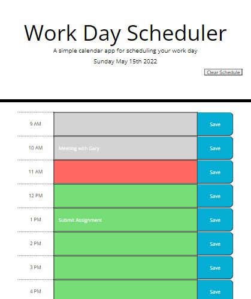

# Work-Day-Scheduler

Authored by Charissa Hollister 05/10/2022

## Description
List notes and overall site features here 

## HTML
List notes and features here 

## CSS
List notes and features here 

## Script
List notes and features here 

## Website Access
### URL Live Webpage: 
### GitHub Repo:

## Future improvement opportunities
List them here 

### Minimum customer criteria
AS AN employee with a busy schedule 
I WANT to add important events to a daily planner 
SO THAT I can manage my time effectively 
GIVEN I am using a daily planner to create a schedule 
WHEN I open the planner 
THEN the current day is displayed at the top of the calendar 
WHEN I scroll down 
THEN I am presented with time blocks for standard business hours 
WHEN I view the time blocks for that day 
THEN each time block is color-coded to indicate whether it is in the past, present, or future 
WHEN I click into a time block 
THEN I can enter an event 
WHEN I click the save button for that time block 
THEN the text for that event is saved in local storage 
WHEN I refresh the page 
THEN the saved events persist 

In order to succeed in this Challenge, you will apply the following skills: 
Implement third-party libraries such as Bootstrap, jQuery, and Moment.js 
Perform DOM traversals and manipulations with jQuery 
Use jQuery to save user input in local storage 
Work with the Bootstrap grid layout in HTML 
Work with Bootstrap components 
Add custom color styles to an existing CSS framework 
Work with custom fonts and icons via a content delivery network (CDN) 
